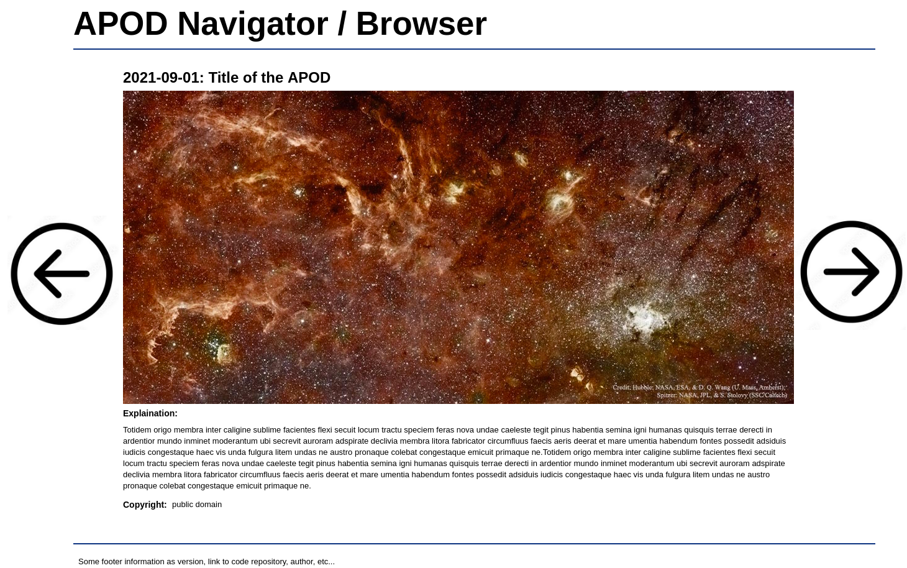

# Kata APOD

<!-- start:apropos -->
> **À propos**
>
> ⓘ Ce dépôt contient un [kata], c'est à dire un _exercice de programmation_
> généralement utilisé dans le cadre d'un [coding dojo]. Il est proposé aux
> membres du dojo de l'[EPFL] et fait partie d'une collection de différents
> katas identifiés par le topic **[epfl-dojo-kata]** sur GitHub.
>
> Comment participer ?
>
>  - Réalisez le kata dans le langage de programmation de votre choix.
>  - Ajoutez-vous à la liste des participants en proposant une [pull request].
>  - Partagez votre intérêt pour ce dépôten lui ajoutant une ⭐.
>  - Proposez des suggestions ou signalez des bugs en ouvrant une issue.
>
> Bonne lecture et bon code !

[kata]: https://fr.wikipedia.org/wiki/Coding_dojo#Kata
[coding dojo]: https://fr.wikipedia.org/wiki/Coding_dojo
[EPFL]: https://www.epfl.ch
[epfl-dojo-kata]: https://github.com/topics/epfl-dojo-kata
[Pull Request]: https://docs.github.com/en/pull-requests/collaborating-with-pull-requests/proposing-changes-to-your-work-with-pull-requests/about-pull-requests

<!-- Texte mis à jour en juin 2025 -->
<!-- end:apropos -->

## But

Le but de ce kata est d'exercer le HTML / CSS / JS en créant un "browser" de
la photo d'astronomie du jour, fournie par la NASA, connue sous l'acronyme
**APOD** ("Astronomy Picture of the Day"). Il s'agit de proposer une version
alternative de <https://apod.nasa.gov/apod/astropix.html>.

## À disposition

La NASA fournit des APIs, disponibles sur <https://api.nasa.gov/>. Des
informations sur l'API **APOD** sont disponibles sur cette même page tout comme
sur le dépôt GitHub <https://github.com/nasa/apod-api>. En JavaScript,
il est facile de récupérer des informations d'une API en utilisant
[fetch](https://developer.mozilla.org/en-US/docs/Web/API/Fetch_API), mais ce
n'est qu'un moyen parmis beaucoup d'autres.

## Réalisation

1. L'application peut être auto-contenue dans un fichier HTML ou séparées en
   plusieurs fichiers (par exemple pour le CSS ou le JavaScript).
1. Le code de l'application doit se trouver sur un repo Git accessible
   publiquement, car l'exercice porte aussi sur la qualité des messages de commits
   (et le suivi de l'évolution du code de l'application à travers ces derniers).
1. La proposition de mise en page (ci-dessous) est une suggestion permettant de
   mettre en avant les fonctionnalités attendues. L'esthétisme n'est pas un
   critère, mais ne fait pas de mal...
1. Il n'y a pas de contrainte sur les outils, mais l'utilisation de
   [fetch](https://developer.mozilla.org/en-US/docs/Web/API/Fetch_API)
   est suggérée. Ce kata peut aussi être un bon prétexte pour apprendre
   [jQuery](https://jquery.com/) ou un framework tel que [vue](https://vuejs.org/)
   ou [react](https://reactjs.org/).
1. On peut commencer à partir de ce dépôt, en le
   [forkant](https://docs.github.com/en/github/collaborating-with-pull-requests/working-with-forks/about-forks)
   dans son propre compte.

## Proposition de mise en page

## Fonctionnalités attendues / checklist

- [ ] La page a un titre
- [ ] La page a un pied de page, avec au moins un lien vers le dépôt de code
- [ ] Le titre de l'APOD est présent
- [ ] La date de l'APOD est présente
- [ ] La description de l'APOD est présente
- [ ] Le copyright de l'APOD est présent ([info](https://github.com/nasa/apod-api#copyright))
- [ ] Le média est affiché. Il peut s'agir :
  - [ ] D'une image, qui offrira un lien vers sa version HD
  - [ ] D'une vidéo, qui offrira un player pour la visionner
- [ ] Des boutons suivant et précédent sont présents
   - [ ] Le bouton précédent est un lien vers l'image du jour précédent
   - [ ] Le bouton suivant est un lien vers l'image du lendemain, mais n'est pas  
         cliquable si l'APOD est celui d'aujourd'hui
- [ ] Les balises [meta](https://developer.mozilla.org/fr/docs/Web/HTML/Element/meta)
      (notamment `description`, `author` et `keywords`) sont renseignées dans le
      `<head>` de la page HTML
- [ ] Le titre de la page (`<title>`) affiche un texte avec la date (par exemple
      "Kata APOD 2024-09-10")

### Bonus

- [ ] L'application est disponible en ligne, par exemple sur
      [GitHub pages](https://pages.github.com/)
- [ ] Il est possible de copier l'URL d'un APOD (avec la date d'un jour 
      spécifique) pour la partager
- [ ] Il est possible d'accéder à l'APOD d'une date précise en la spécifiant 
      dans l'URL (par exemple `?date=2024-09-10`)
- [ ] L'application offre la possibilité de gérer la clé d'API  
      (l'utilisateur peut mettre sa propre clé plutôt que DEMO_KEY)

### Et pour finir

- [ ] Une fois terminé, ajouter les liens vers votre code et/ou votre page avec
      ci-dessous

## Je l'ai fait 💪

- [@Azecko](https://github.com/Azecko): [code](https://github.com/Azecko/Kata-APOD) / [app](https://azecko.github.io/Kata-APOD/)  
  jQuery FTW

- [@Dwesh163](https://github.com/Dwesh163): [code](https://github.com/Dwesh163/Kata-APOD) / [app](https://Dwesh163.github.io/Kata-APOD/)  
  Vanilla JS

- [@JaavLex](https://github.com/JaavLex): [code](https://github.com/JaavLex/Kata-APOD) / [app](https://kata-apod.vercel.app)  
  Angular CLI version 12.2.6

- [@Jch4ipas](https://github.com/Jch4ipas): [code](https://github.com/Jch4ipas/kata-APOD) / [app](https://jch4ipas.github.io/kata-APOD/)  
  Vanilla JS

- [@octocat](https://github.com/octocat): [code](https://#) / [app](https://#)  
  Une petite présentation de votre version, par exemple quelles technologies
  vous avez utilisées, qu'est-ce que votre version a de mieux que
  l'[originale](https://apod.nasa.gov/apod/astropix.html), etc...
